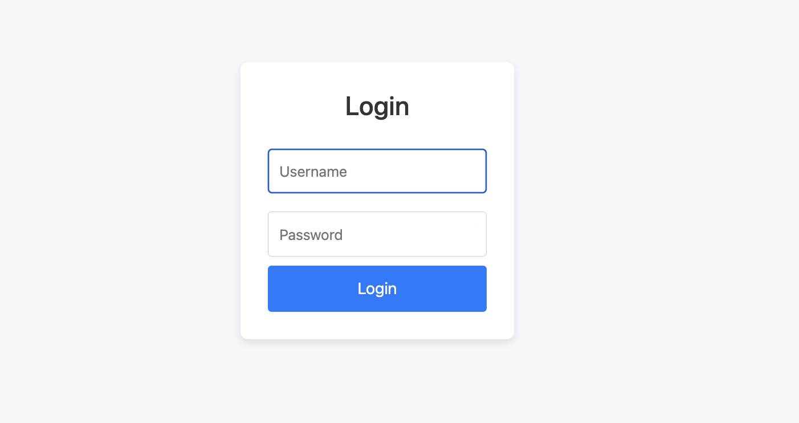

# node, npm install on ubuntu
```
sudo apt update -y
sudo apt install -y nodejs npm
```


Project: Frontend (React) and Backend (NodeJS) 
 
# Usage

## To Build and Run - Frontend (ReactJS app)

```
cd ./frontend
npm install
npm start
```

To access the Frontend application: http://localhost:3000

## To Build and Run - backend (NodeJS app)

```
cd ./backend
npm install
npm start
```

backend run on url: http://localhost:9000


## Demo steps 

1. Run backend first and then run frontend 
   > **Note:** <br /> If you plan to change backend port number update the same port in frontend code (Dashboard.js, LoginForm.js)
2. To access the Frontend application: http://localhost:3000
   > **Note:** <br /> If you run npm start - usually npm will auto open in default browser and manually you access with above url
3. Login with username: admin and Password: admin 
   > **Note:** <br /> you can change password in backend/server.js 

4. Login page: 
    
   Dashboard: 
    
